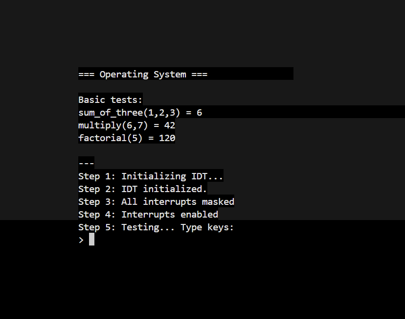
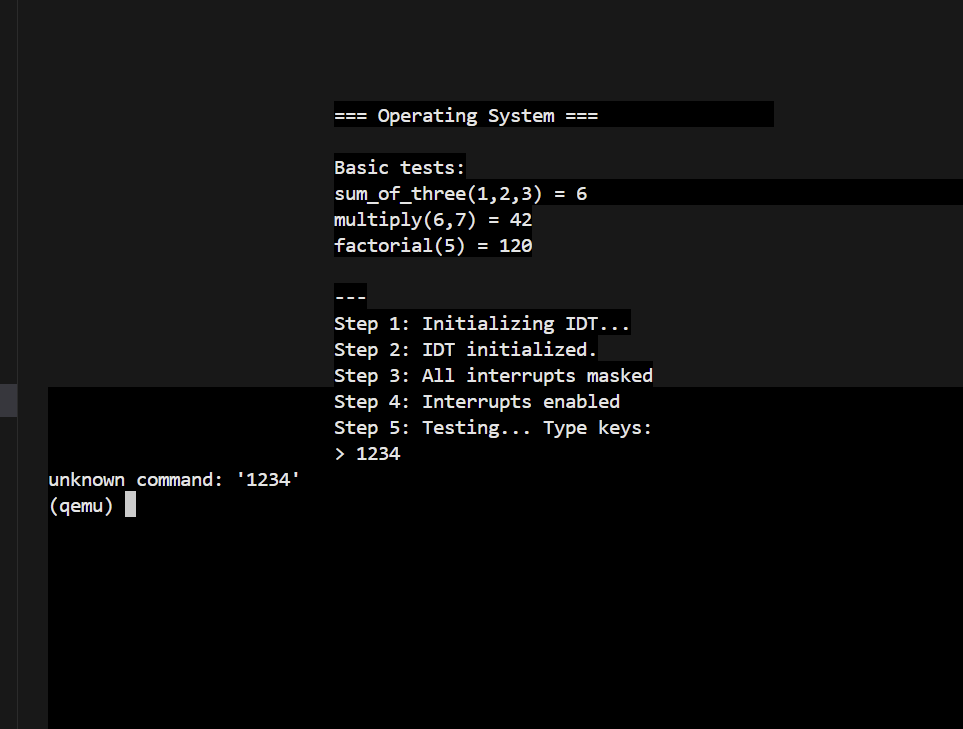
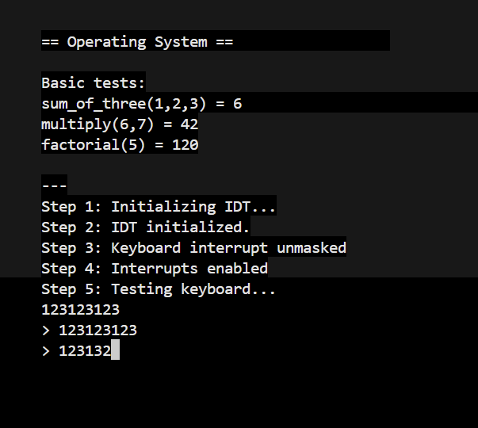
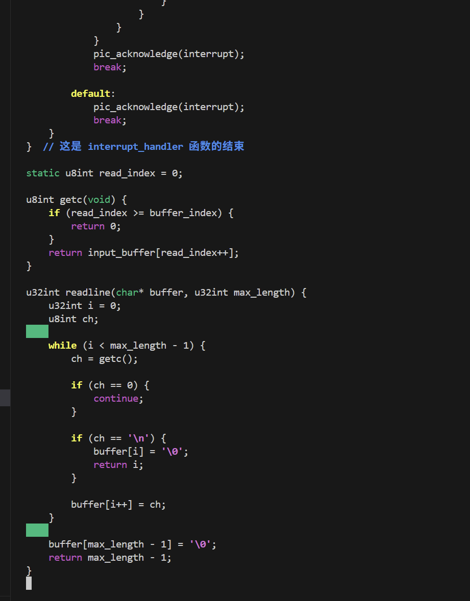
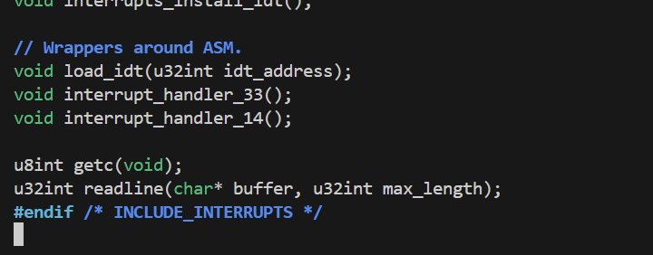
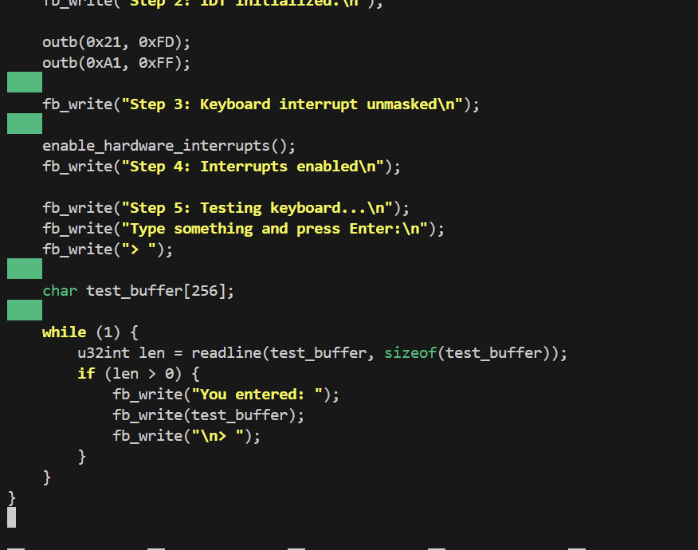
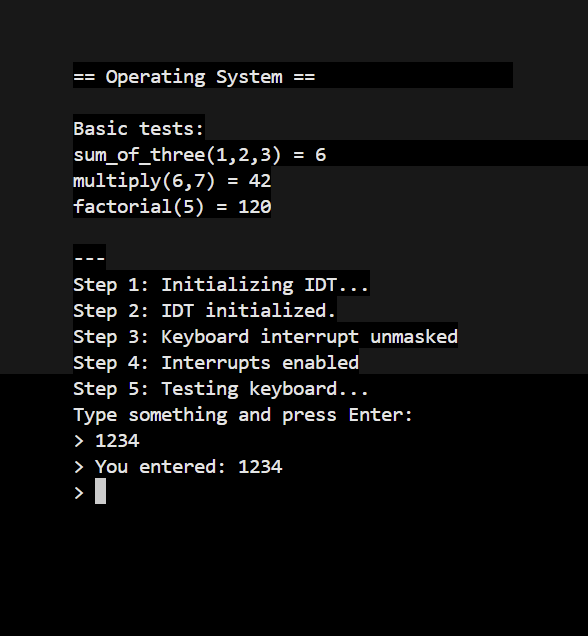
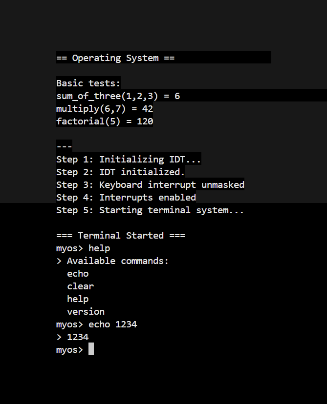
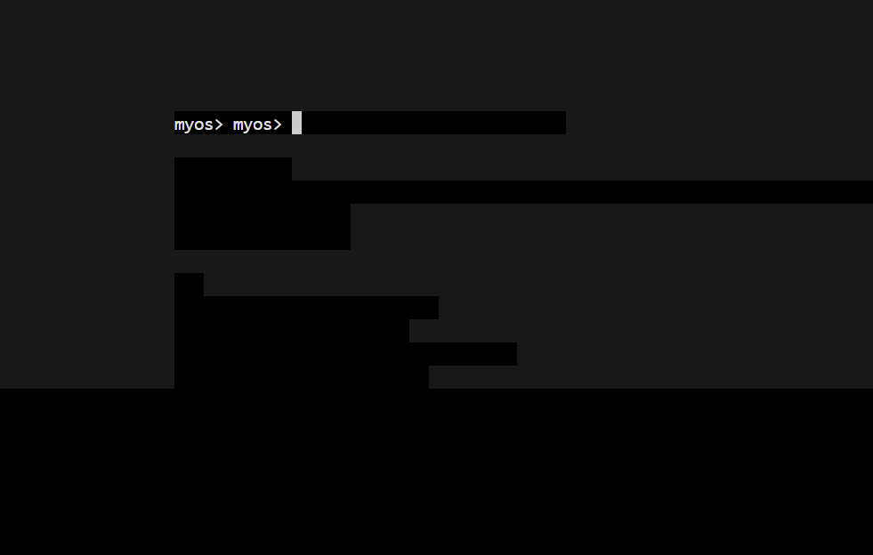
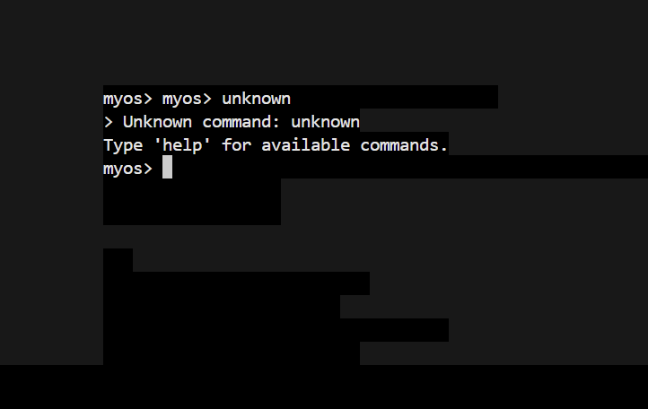

## Worksheet 2 Part 1

### Task 1: Booting a Tiny OS
- **Description:** Developed a minimal operating system that boots from scratch using GRUB bootloader
- **Key Features:**
  - Multiboot-compliant kernel
  - Custom linker script for memory layout
  - ISO image generation for booting
- **Files:**
  - `source/loader.asm` - Boot loader in assembly
  - `source/link.ld` - Linker script
  - `iso/boot/grub/menu.lst` - GRUB configuration

**Screenshots:**
 - GRUB boot menu  
 - Kernel loading process  
 - Successful boot verification

### Task 2: Calling C from Assembler
- **Description:** Extended the kernel to support calling C functions from assembly code
- **Key Features:**
  - Mixed assembly and C programming
  - Function parameter passing between languages
  - Multiple custom C functions implementation
- **Implemented Functions:**
  - `sum_of_three(int a, int b, int c)` - Returns sum of three integers
  - `multiply(int a, int b)` - Returns product of two integers  
  - `factorial(int n)` - Returns factorial of a number

**Screenshots:**
 - Function implementation  
 - Assembly to C calling mechanism  
 - Compilation process  
 - Function testing output  
 - Memory verification  
 - Complete test suite

### Task 3: Framebuffer Driver Development
- **Description:** Implemented a complete framebuffer driver for text output with full 2D API
- **Key Features:**
  - Memory-mapped I/O for framebuffer access
  - I/O port control for hardware cursor
  - Complete 2D text rendering API
  - Color support and cursor positioning

**Screenshots:**
 - Successful compilation with framebuffer support
 - File structure showing driver implementation
 - Complete test output showing all functionality working

## Worksheet 2 Part 2

### Task 1: Keyboard Input & Interrupt Handling
- **Description:** Implemented keyboard input handling through hardware interrupts using the Programmable Interrupt Controller (PIC)
- **Key Features:**
  - Interrupt Descriptor Table (IDT) setup for handling hardware interrupts
  - PIC initialization and remapping to avoid conflicts with CPU exceptions
  - Keyboard interrupt (IRQ1) handling and unmasking
  - Scan code to ASCII conversion with full US QWERTY keyboard support
- **Files Modified:**
  - `drivers/interrupts.h` - IDT structures and function declarations
  - `drivers/interrupts.c` - Interrupt handling implementation
  - `drivers/interrupt_asm.s` - Assembly interrupt handlers
  - `drivers/interrupt_handlers.s` - IDT loading functions
  - `drivers/pic.h`, `drivers/pic.c` - PIC configuration
  - `drivers/keyboard.h`, `drivers/keyboard.c` - Keyboard driver

**Screenshots:**

 - IDT initialization and basic interrupt setup  
 - Keyboard interrupt unmasking and PIC configuration  
 - Hardware interrupts successfully enabled  
 - Basic keyboard input test showing character echo

### Task 2: Input Buffer API Implementation
- **Description:** Created an efficient keyboard input buffer system with circular buffer management
- **Key Features:**
  - Circular buffer implementation for efficient input storage
  - Thread-safe buffer access with interrupt synchronization
  - Complete API for character and line input retrieval
  - Buffer overflow protection and error handling
- **API Functions:**
  - `u8int getc(void)` - Retrieves a single character from input buffer
  - `u32int readline(char* buffer, u32int max_length)` - Reads a complete line until Enter
- **Files Modified:**
  - `drivers/interrupts.c` - Added buffer management and API functions
  - `drivers/interrupts.h` - Added API function declarations

**Screenshots:**

 - `getc()` function implementation in interrupts.c  
 - `readline()` function implementation and buffer management  
 - Buffer API testing code in kernel.c  
 - Successful line input using `readline()` function

### Task 3: Terminal Implementation
- **Description:** Developed a basic Unix-like terminal interface with command processing capabilities
- **Key Features:**
  - Custom command prompt "myos>"
  - Command parsing with argument separation
  - Extensible command system with function table
  - Graceful error handling for unknown commands
  - 4 implemented commands (exceeding minimum requirement of 2)
- **Implemented Commands:**
  - `echo [text]` - Displays provided text
  - `clear` - Clears the terminal screen
  - `help` - Lists all available commands
  - `version` - Displays operating system version
- **Files Created:**
  - `drivers/terminal.h`, `drivers/terminal.c` - Terminal implementation
  - `drivers/string.h`, `drivers/string.c` - String utility functions

**Screenshots:**

 - Terminal startup with "myos>" prompt and initialization  
 - Help command showing all available commands  
 - Echo command demonstrating argument processing
