## Task Completion

### Task 1: Booting a Tiny OS
- **Description:** Developed a minimal operating system that boots from scratch using GRUB bootloader
- **Key Features:**
  - Multiboot-compliant kernel
  - Custom linker script for memory layout
  - ISO image generation for booting
- **Files:**
  - `source/loader.asm` - Boot loader in assembly
  - `source/link.ld` - Linker script
  - `iso/boot/grub/menu.lst` - GRUB configuration

**Screenshots:**
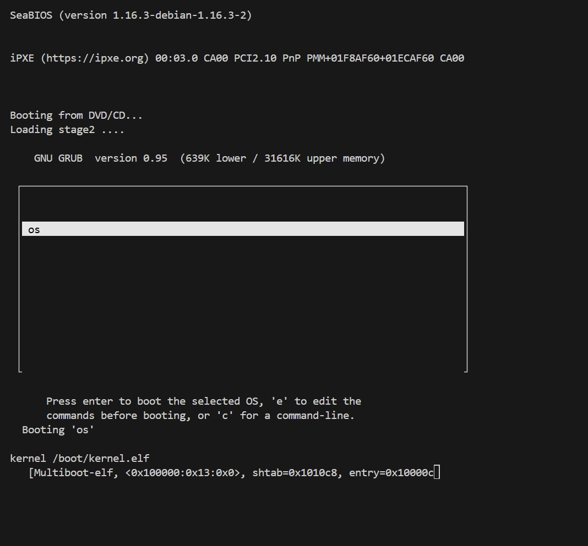 - GRUB boot menu  
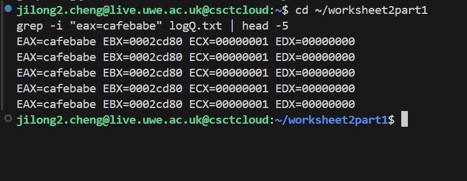 - Kernel loading process  
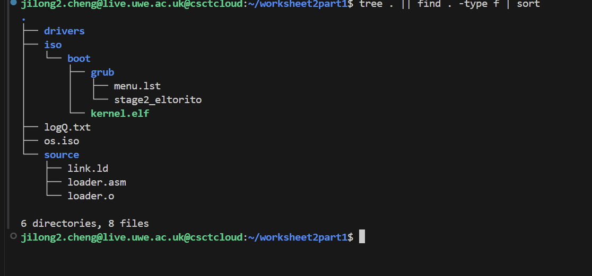 - Successful boot verification

### Task 2: Calling C from Assembler
- **Description:** Extended the kernel to support calling C functions from assembly code
- **Key Features:**
  - Mixed assembly and C programming
  - Function parameter passing between languages
  - Multiple custom C functions implementation
- **Implemented Functions:**
  - `sum_of_three(int a, int b, int c)` - Returns sum of three integers
  - `multiply(int a, int b)` - Returns product of two integers  
  - `factorial(int n)` - Returns factorial of a number

**Screenshots:**
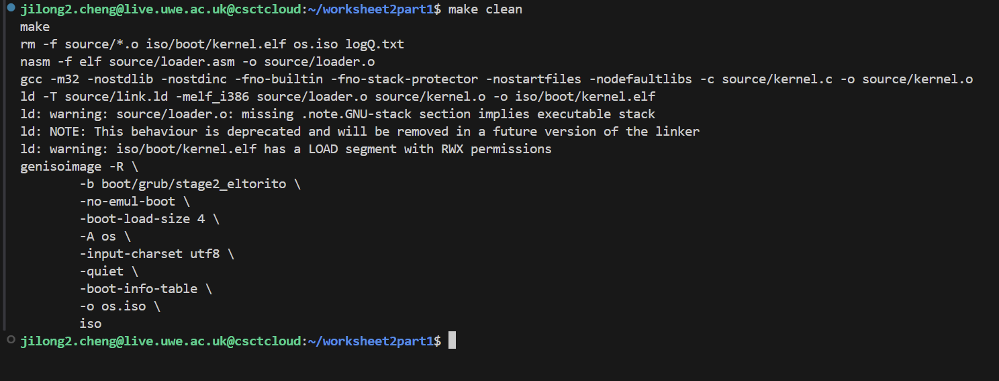 - Function implementation  
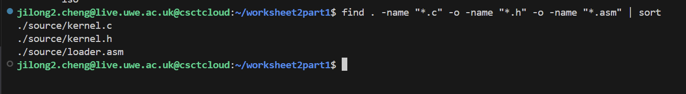 - Assembly to C calling mechanism  
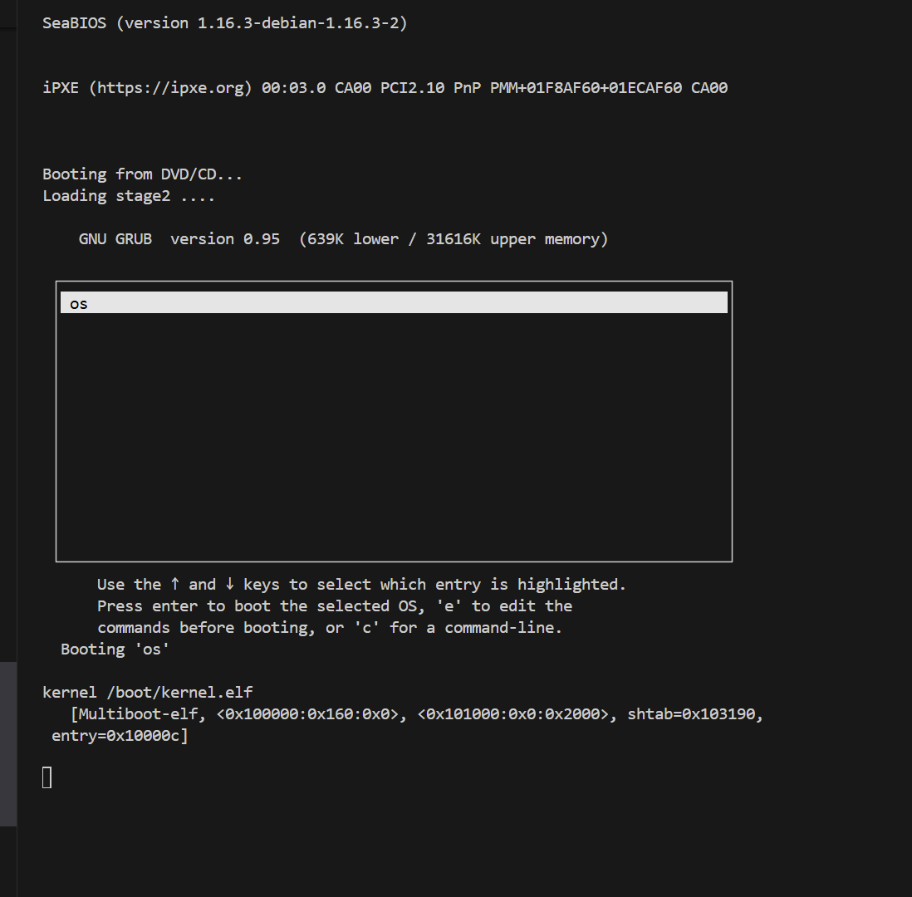 - Compilation process  
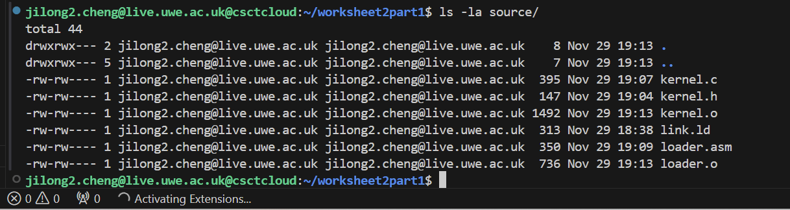 - Function testing output  
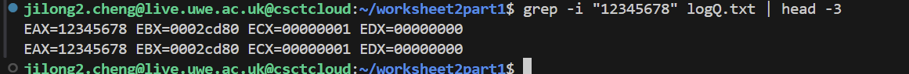 - Memory verification  
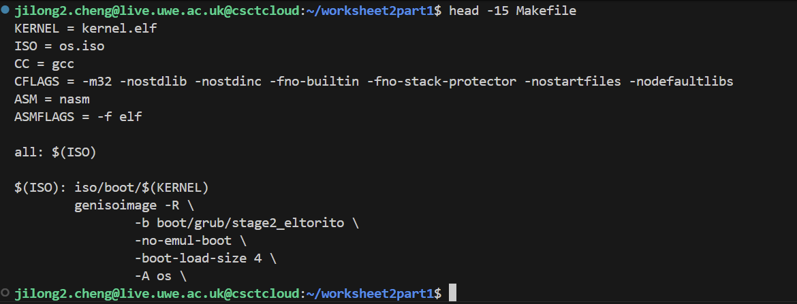 - Complete test suite

### Task 3: Framebuffer Driver Development
- **Description:** Implemented a complete framebuffer driver for text output with full 2D API
- **Key Features:**
  - Memory-mapped I/O for framebuffer access
  - I/O port control for hardware cursor
  - Complete 2D text rendering API
  - Color support and cursor positioning

**Screenshots:**
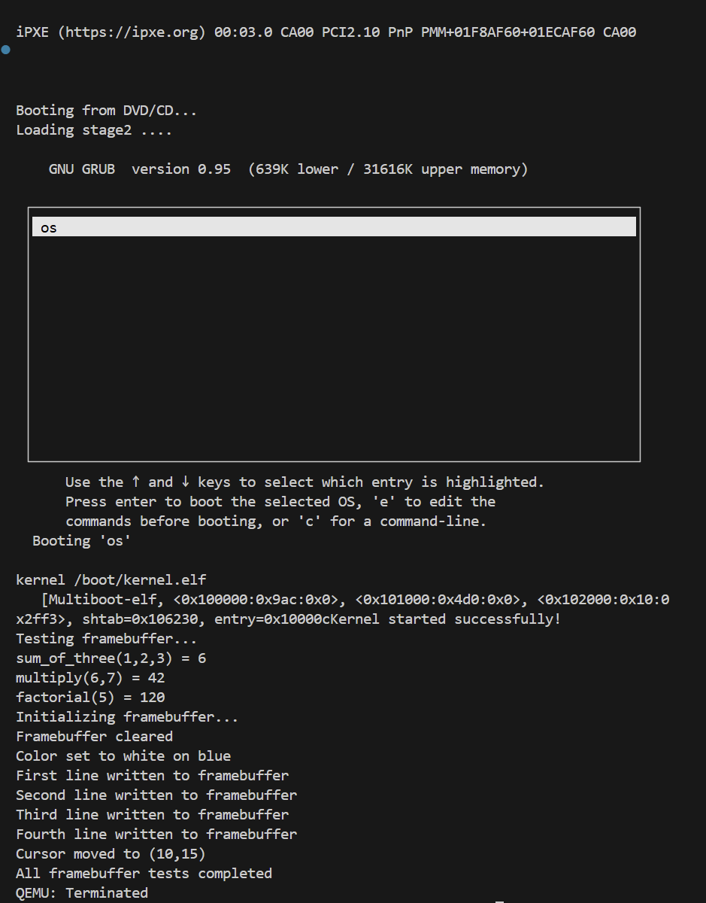 - Successful compilation with framebuffer support
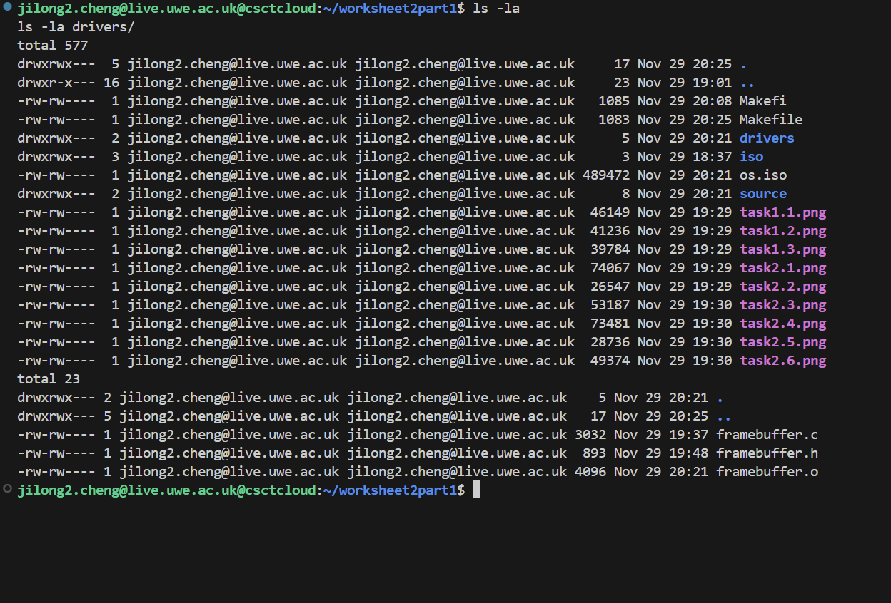 - File structure showing driver implementation
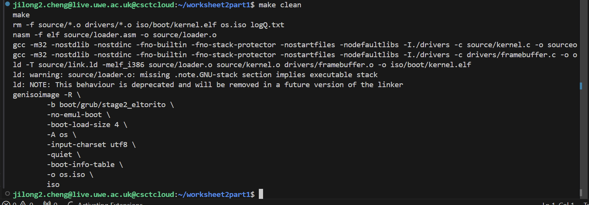 - Complete test output showing all functionality working

**Framebuffer API:**
```c
void fb_clear(void);                          // Clear screen
void fb_move_cursor(unsigned short pos);     // Move cursor to position
void fb_move(unsigned short x, unsigned short y); // Move cursor to coordinates
void fb_write_char(char c, unsigned char fg, unsigned char bg); // Write character
void fb_write(char* text);                   // Write string
void fb_write_dec(int num);                  // Write decimal number
void fb_write_hex(unsigned int num);         // Write hexadecimal number
void fb_set_color(unsigned char fg, unsigned char bg); // Set text colors

